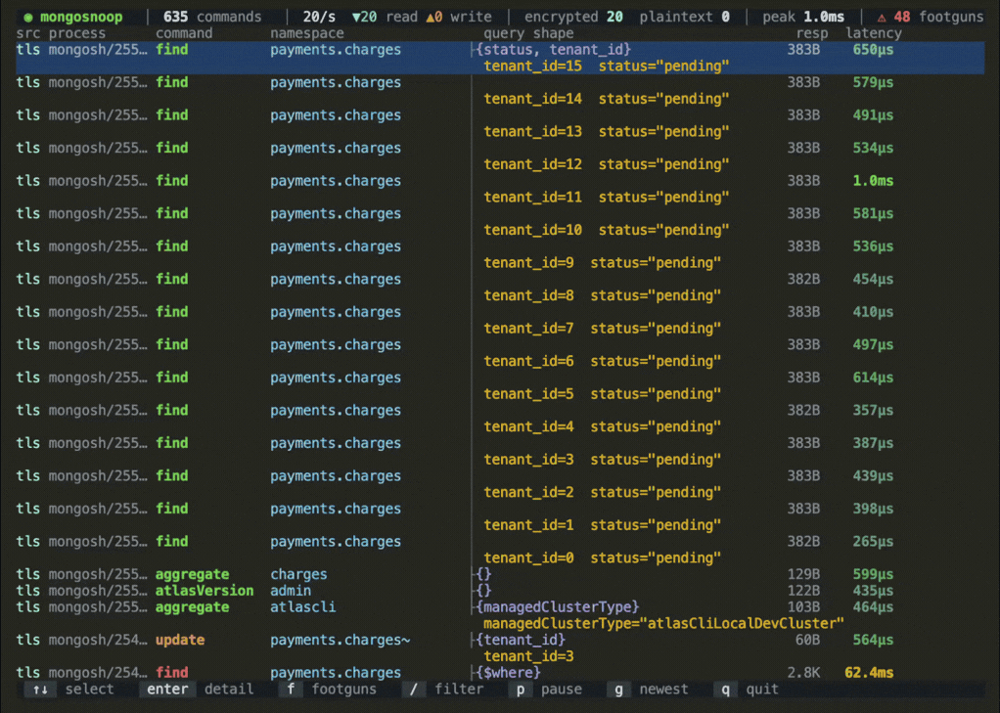

<!-- yeet:user-friendly-title: Watch MongoDB queries -->
# `mongosnoop`

> **`tcpdump` for your MongoDB queries.** Watch every command your app sends, encrypted or not, without touching the app or the database.

<p align="center">
  <a href="#requirements"></a>
  <a href="https://yeet.cx/docs/?utm_source=github&utm_medium=readme&utm_campaign=mongosnoop&utm_content=badge"></a>
  <a href="#how-it-works"></a>
  <a href="#license"></a>
  <a href="https://discord.gg/JxVseaAVAU"></a>
</p>

<p align="center">
  
</p>

**`mongosnoop` is a live terminal MongoDB query monitor for Linux: it streams every command any process on the box sends, grouped by query shape, with the concrete filter values and the round-trip latency.**

## Quick start

```sh
curl -fsSL https://yeet.cx | sh   # install yeet, once
yeet run gh:yeet-src/mongosnoop   # clone, build and run in one step
```

MongoDB's database profiler is server-side, off by default, samples at a threshold, and wants write access to the database you are debugging. It also cannot see the client, so it will not tell you which process issued a query or that one HTTP request produced two hundred of them.

`mongosnoop` attaches to the socket instead. One run watches every MongoDB client on the host at once, none of them know they are being traced, and nothing is asked of the server. Where you would otherwise enable `db.setProfilingLevel()` on a shared cluster, or bisect an ORM until it confesses what it generated, you get the command as the driver actually sent it.

> [!TIP]
> **The shape is the point.** A slow-query log tells you a query was slow. It cannot easily tell you the same query ran two hundred times in one request. `mongosnoop` strips the values out of every filter, so `{customer_id: ObjectId(...), status: "pending"}` becomes `{customer_id, status}`, then collapses a repeated shape into one block. An N+1 stops being twenty-five rows you have to notice are identical and becomes one thing happening twenty-five times.

## Contents

**Run it** — [Get started](#get-started) · [Have an agent set it up](#have-an-agent-set-it-up) · [Reading it without a TTY](#reading-it-without-a-tty)
**Understand it** — [A 60-second primer on the MongoDB wire protocol](#a-60-second-primer-on-the-mongodb-wire-protocol) · [Questions this tool answers](#questions-this-tool-answers) · [What you're looking at](#what-youre-looking-at) · [Navigation](#navigation) · [How it works](#how-it-works)
**Reference** — [Requirements](#requirements) · [What it can't see](#what-it-cant-see) · [FAQ](#faq)
**Contribute** — [Building from source](#building-from-source) · [Testing across kernels](#testing-across-kernels) · [Try it without real traffic](#try-it-without-real-traffic)

## Get started

```sh
curl -fsSL https://yeet.cx | sh
make            # clang + bpftool → bin/probe.bpf.o ; esbuild → the JS bundle
yeet run .      # watch every plaintext MongoDB connection on the host
```
[Manual install guide](https://yeet.cx/docs/manual-installation?utm_source=github&utm_medium=readme&utm_campaign=mongosnoop) | Linux only

With no flags it reads plaintext connections. Driver chatter (`hello`, `ping`, handshakes) is hidden by default, because an idle connection pool heartbeats every few seconds per connection and would otherwise bury your application's traffic; press `n` to show it.

Encrypted connections need a target for the TLS probes, passed after `--` so the runtime routes the flag to the script rather than to `yeet` itself:

```sh
yeet run . -- --tls-binary libssl.so             # every dynamically-linked client at once
yeet run . -- --tls-binary "$(command -v node)"  # a statically-linked runtime, by path
yeet run . -- --tls-binary auto                  # find a running Node-family binary
```

A uprobe only fires for processes that start **after** it attaches, so start `mongosnoop` before your workload. A client already running when you attach stays invisible until it restarts.

It runs until you press `q` (or `Ctrl-C`), reflows when you resize the terminal, and needs a real TTY. Don't pipe or redirect it; for text output see [Reading it without a TTY](#reading-it-without-a-tty).

## Have an agent set it up

Paste this to a coding agent on the target Linux box:

```
Set up and verify github.com/yeet-src/mongosnoop on this machine.

1. Clone it (or `git pull` if it's already here) and read AGENTS.md.
2. Install yeet if it isn't present: curl -fsSL https://yeet.cx | sh
3. Run `make`. It fetches its own clang/bpftool/esbuild, so a missing system
   toolchain is not an error.
4. Start traffic in a second shell: `demo/run.sh`
   It starts a throwaway MongoDB in Docker and drives it. Do not start a
   separate mongod.
5. Verify from the headless probe, NOT the TUI:
   `yeet run src/probes/mongo.js`
   Expect [OP_MSG] lines naming a verb and a namespace within a few seconds.
   Ctrl-C to stop.
6. Report the first three event lines verbatim.

"It compiled" is not the same as "it works". Step 5 is the check that matters:
if no events arrive, say so rather than reporting success. If the only lines
are handshake commands, the demo traffic isn't running.
```

Prefer to drive it yourself? [Get started](#get-started) is three lines.

## A 60-second primer on the MongoDB wire protocol

A driver does not send text. It sends a framed binary message, and every one opens with the same 16-byte header:

```
int32 messageLength | int32 requestID | int32 responseTo | int32 opCode
```

`requestID` is a fresh number the client picks per message. The server's reply echoes it back in `responseTo`. That pairing is what makes per-command latency measurable without guessing.

After the header comes the command itself, as **BSON**, a binary format of typed, length-prefixed elements. The first field of a command document names the operation and its value names the collection, so a `find` on `orders` starts with the key `find` and the string `orders`. The database arrives separately, in a `$db` field appended after the operation's own fields.

Two terms the rest of this README uses:

| term | what it means here |
| --- | --- |
| **OP_MSG** | opcode 2013, the only message type modern drivers use for commands. Older opcodes still appear during the handshake |
| **query shape** | the filter with every value stripped. `{tenant_id: 4, status: "pending"}` and `{tenant_id: 9, status: "pending"}` are both `{status, tenant_id}` |

The catch, and the reason for [the fixed capture window](#keeping-the-kernel-dumb): BSON elements are variable-length, so walking one properly needs unbounded loops that the BPF verifier rejects. The kernel reads only what sits at a shallow fixed offset and hands the rest to userspace.

## Questions this tool answers

**My ORM is generating some query that's slow and I can't tell what it actually sends to MongoDB. How do I see the real command?**
Run `yeet run .` and watch the feed. You get the command as the driver serialized it, after Mongoose, Prisma, or whatever aggregation builder has had its say, plus the concrete values it filtered on. No echo flag, and it reads the same for Python, Node, or a binary you don't have source for.

**One HTTP request feels slow and I suspect the code is querying in a loop. How do I confirm an N+1 against MongoDB?**
Hit the endpoint and watch. A repeated shape collapses into one block behind a continuation rail, so twenty-five `find` calls that differ only in an id read as a single visual run rather than a wall you have to parse. The block's height is the repeat count. Press `Enter` on it and the overlay says how many times that shape ran in the retained window.

**How do I see which queries a process is running right now, on a box where I can't install anything or add instrumentation to the app?**
That's the default mode. One `yeet run` attaches kprobes on the socket path, so every MongoDB client on the host appears in the same feed identified by its `comm/pid`. Nothing is added to the traced application and nothing is restarted.

**Can I watch MongoDB queries without enabling the database profiler or getting write access to the cluster?**
Yes, and that's the design. `db.setProfilingLevel()` is a server-side switch that samples at a threshold and needs privileges on the database you're debugging. `mongosnoop` reads the client side of the connection, so a read-only user on a shared cluster changes nothing about what you can see.

**My MongoDB connection is TLS and tcpdump just shows me ciphertext. How do I read the queries?**
Point `--tls-binary` at the client's crypto library or binary and the same commands decode in full. The probes read at the TLS boundary, before encryption on the way out and after decryption on the way back, so the rows carry a real round-trip latency rather than none. Coverage depends on the client: see [Reading encrypted traffic](#reading-encrypted-traffic) for which ones work and which two don't.

**Which of my query shapes is actually the slow one, and is it slow every time or only sometimes?**
Press `Enter` on a row. The overlay aggregates p50, p95, p99 and max across every logged run of that exact shape against that namespace, with a sparkline of recent runs oldest to newest. That's what separates a consistently expensive query from one unlucky run under contention.

**Is my service about to do something stupid to the database before I ship it?**
Press `f` for the flagged-only view. It surfaces `$where`, unanchored `$regex`, unbounded collection reads, and empty-filter deletes as they happen, each with a one-line reason. Running a test suite through it is a pre-launch review in a couple of minutes.

**Is this a replacement for Datadog, MongoDB Atlas monitoring, or my APM?**
No. There's no retention, no query language, no alerting, and no fleet view; `mongosnoop` keeps the most recent 2000 commands in memory on one host and forgets them when you quit. It's the live-debugging instrument you reach for once an APM has told you the database is slow and you need to see the actual queries and values. Use both.

**When should I use this instead of `mongosh`, the database profiler, or `tcpdump`?**
Reach for `mongosnoop` when you want the commands a process you didn't instrument is sending, especially several processes at once, and especially over SSH on a box where you'd rather not install anything. Reach for the profiler when you want server-side execution stats with retention and you have the privileges. Reach for `explain` when the question is which index a query used, which the wire cannot answer. `tcpdump` sees TCP segments, which tells you bytes moved but never which command caused them. For Redis rather than MongoDB, [`redissnoop`](https://github.com/yeet-src/redissnoop) is the sibling.

## What you're looking at

```
src process      command       namespace                 query shape           resp  latency
tls mongosh/2551 find          payments.charges        ├{status, tenant_id}   383B    650µs
                                                         tenant_id=15  status="pending"
tls mongosh/2551 find          payments.charges        │                      383B    579µs
                                                       │ tenant_id=14  status="pending"
tls mongosh/2551 find          payments.charges        │                      383B    491µs
                                                       │ tenant_id=13  status="pending"
tls mongosh/2551 update        payments.charges~       ├{tenant_id}            60B    564µs
                                                         tenant_id=3
tls mongosh/2549 find          payments.charges        ├{$where}              2.8K   62.4ms
                                                         $where="this.amount > 4500"
                                                         ⚠ $where runs JS per document and can't use an index
```

Three regions. The **title bar** carries running totals, per-second rates, the read/write split, the encrypted/plaintext split, and the flagged count. The **feed** fills the body, newest command at the top. The **footer** shows key hints, or the live filter prompt while you're typing one.

| column | meaning |
| --- | --- |
| `src` | `tls` when the command was read inside an encrypted connection, blank when read off the socket in plaintext |
| `process` | the client that sent it, as `comm/pid`, so several apps on one cluster stay distinguishable |
| `command` | the verb (`find`, `insert`, `aggregate`, `update`). Coloured by read versus write, and red when flagged |
| `namespace` | `db.collection`. A trailing `~` means the database was recalled from an earlier command rather than read off this one |
| `query shape` | the filter with values stripped. `{}` is a real answer and means no predicate at all |
| `resp` | bytes the server sent back, the cheapest proxy for how much this actually returned |
| `latency` | request to reply round trip, heat-coloured on a log scale from roughly 100µs cool to 1s hot |

The `├` and `│` rail is the repeat marker. A run of the same verb, shape and namespace **within one process** states its shape once and then draws a rail, so a query in a loop reads as one block. A dim line under each row carries the concrete filter values, and a red `⚠` line names the problem when a command trips one of the checks below.

### What gets flagged

Each flag is a fact about the command as sent, not a guess about the server's plan:

| flag | why |
| --- | --- |
| `$where` | runs server-side JavaScript per document and cannot use an index |
| unanchored `$regex` | scans the collection. An anchored `/^foo/` can use an index prefix and is deliberately not flagged |
| `find` or `count` with no filter and no limit | reads the whole collection |
| `delete`, or a multi-`update`, with an empty filter | matches every document |
| `aggregate` with `allowDiskUse` | the pipeline expects to exceed the 100 MB in-memory limit |
| `$lookup` in a pipeline | joins per input document |

"This query has no index" is deliberately absent. Index usage is a property of the server's execution plan, which the wire does not carry. A false alarm erodes trust faster than a missed one.

## Navigation

The feed follows the newest command by default. Move the cursor off the top row and the view **holds**, showing the snapshot you're reading while commands keep arriving underneath. Press `g` to jump back to newest and resume.

| key | action |
| --- | --- |
| `↑`/`↓`, `j`/`k` | move the cursor (holds the view once you leave the newest row) |
| `PgUp`/`PgDn` | move ten rows; the mouse wheel moves three |
| `Enter` | open the detail overlay for the selected command |
| `f` | flagged-only view; press again for everything |
| `n` | show driver chatter (`hello`, `ping`, handshakes), hidden by default |
| `/` | fuzzy filter, matching process, verb, namespace, shape and filter values at once |
| `p` | pause. Unlike the hold, this survives jumping back to the top |
| `g` | jump to newest and resume following |
| `q` / `Esc` | quit (`Esc` closes the overlay or clears the filter first) |

### The detail overlay

`Enter` opens one command in full, and adds what the feed cannot show:

- **This command**: verb, namespace, shape, process, latency, bytes each way, `requestID`, and `limit`/`batchSize` when present.
- **Every filter value** in full, where the feed clips them.
- **Across every run of this shape against this namespace**: run count, the processes issuing it, p50/p95/p99/max latency, how many runs tripped a flag, and a sparkline of the most recent runs.
- **The command document** as captured, nested, with BSON scalars in their tagged form.

The command you opened is a frozen snapshot, but the cross-run panel reads the live log, so a hot shape's percentiles keep moving while you watch.

## Reading it without a TTY

A TUI is unreadable to an agent, a CI job, or an SSH session in a hurry. The data layer runs standalone and prints plain text:

```sh
yeet run src/probes/mongo.js
```

It attaches the same probes and prints one line per command until you `Ctrl-C` it:

```
[mongo] attached tcp_sendmsg/tcp_recvmsg — waiting for MongoDB traffic…
[OP_MSG] wire mongosh/46863 req=11 find ns=shop.orders shape={customer_id} lat=0.23ms req=123B resp=100B
   ↳ customer_id=4
[OP_MSG] TLS  mongosh/48516 req=6 find ns=secure.vault shape={status, tenant_id} lat=1.13ms req=141B resp=101B
```

This is the decoded event stream before the TUI groups it, so repeated shapes appear as separate lines rather than collapsed into a block. That makes it the right thing for verifying the probes work (it is step 5 of [the agent prompt](#have-an-agent-set-it-up)) and for piping somewhere, and the wrong thing for reading a busy system by eye. It takes the same `-- --tls-binary` flag.

There is no `--json` mode. The `RingBuf.subscribe` callback in [`src/probes/mongo.js`](src/probes/mongo.js) holds every decoded record, so a JSON, HTTP, or Kafka sink is a branch there rather than a rewrite.

## How it works

Three directories, one rule each: [`src/probes/`](src/probes/) is the only BPF-aware code, [`src/components/`](src/components/) is pure presentation, [`src/lib/`](src/lib/) is pure helpers. They're composed in `main.jsx` through the `@/` source alias.

```
src/
├── main.jsx                    composition root: view state, keyboard + wheel input, mount
├── probes/mongo.js             the only BPF-aware module: load, attach, fold events into a log
├── components/
│   ├── titlebar.jsx            totals, rates, read/write and encrypted/plaintext splits
│   ├── commands.jsx            the feed: shape, values, flags, and the repeat rail
│   ├── detail.jsx              the Enter overlay: this command, plus cross-run percentiles
│   └── footer.jsx              key hints and the live filter prompt
└── lib/
    ├── bson.js                 the BSON cursor, shape extraction, value formatting
    ├── classify.js             reads vs writes, driver chatter, the flag rules
    ├── format.js               the palette, durations, byte counts, the latency heat ramp
    └── fuzzy.js                subsequence match + matched-column positions
```

### The BPF side

[`src/bpf/mongo.bpf.c`](src/bpf/mongo.bpf.c) carries six programs across two capture paths that feed one ring buffer. Each event is tagged with the path it came from, which is what the `src` column shows.

| program | attached to | what it captures |
| --- | --- | --- |
| `on_sendmsg` | `tcp_sendmsg` | a command going out in plaintext: header, verb, collection, and a raw window of the BSON body |
| `on_recvmsg` / `_ret` | `tcp_recvmsg` | the reply. The entry probe records where the bytes will land, the return probe reads `responseTo` once they have |
| `on_ssl_write` | `SSL_write` | the same command, read from the application's own buffer **before** encryption |
| `on_ssl_read` / `_ret` | `SSL_read` | the reply **after** decryption, which is what lets TLS rows carry a real latency |

Maps connect kernel to userspace:

- **`mongo_events`** (`RINGBUF`, 512 KB) carries one `mongo_event` per completed command.
- **`inflight`** (`LRU_HASH`, 16384) holds a sent command awaiting its reply, keyed by `(pid << 32 | requestID)`.
- **`recv_scratch`** and **`ssl_recv_scratch`** (`HASH`, 8192 each) pair each entry probe with its return, keyed by `pid_tgid`.
- **`event_scratch`** and **`fl_scratch`** (`PERCPU_ARRAY`) hold the event under construction. A `mongo_event` is well past the 512-byte BPF stack limit once the BSON window is in it, so it cannot be a local.
- **`probe.data`** carries `min_latency_us`, a slow-command floor patched live from JS so filtering happens before the ring buffer rather than after it.

<details>
<summary><strong>Why the correlation key is <code>(pid, requestID)</code> and not the socket</strong></summary>

The obvious pairing is "the next reply on this socket", which is what a Redis snoop can get away with. MongoDB drivers pipeline several in-flight commands over one pooled connection, so that mismatches under exactly the concurrency you care about: four outstanding commands and the replies pair to the wrong requests, producing latencies that are confidently wrong.

`requestID` is a real correlation id the protocol already carries, so the reply names its request directly.

The `pid` half of the key was added after a demo run showed a `2349s` latency. Drivers restart `requestID` at 1 per connection, so two short-lived clients collide: one client's reply looked up another's request from seconds earlier and the subtraction produced nonsense. Keying on the pair makes each process's numbering private.

</details>

### Keeping the kernel dumb

BSON is a binary format of typed, variable-length elements. Walking one properly means loops the verifier rejects, so the kernel does the minimum: it validates the header, lifts the verb and collection from their shallow fixed offsets, and copies a fixed **192-byte window** of the body. Every typed-element walk, shape extraction, value decode and flag check happens in JS in [`src/lib/bson.js`](src/lib/bson.js), where a cursor is just a cursor and a bad read returns what it managed rather than throwing.

The header validation is load-bearing. `messageLength` must match the write size and `responseTo` must be zero on a request; without both, a TCP segment that split mid-message, or an HTTPS call from the same process, parses into a garbage verb and pollutes the feed.

### The JS side

`probes/mongo.js` folds the event stream into an append-only **log of completed commands**, not a mutable per-shape aggregate. A command is frozen the instant its reply pairs and is never touched again, so a row on screen never changes or jumps, and re-running a shape appends rather than updating. That is what makes a loop visible as repetition rather than as a counter ticking. A 250 ms window timer publishes one snapshot per frame, so a busy ring buffer costs one re-render rather than thousands, and the log is capped at 2000 commands.

The database name gets one piece of inference. `$db` is appended after the operation's own fields, so on a large command it falls outside the capture window. It is learned from earlier commands on the same collection in the same process and marked with a trailing `~`, so the display never claims to have read something it inferred.

### Why the socket, not the profiler

MongoDB's profiler is server-side. It is off by default, samples at a threshold, needs privileges on the database you are debugging, and cannot see the client at all: not which process issued a query, not that one request produced two hundred of them.

The socket and the TLS boundary are the seams where *every* client hands a command to the database, before any of that. One attach covers every current and future client of the host with no per-app setup and no restarts, and the database runs exactly as it would if the tool were not there. The cost of that seam is that it is a *client-side* view: it sees what was asked, never how the server chose to answer it, which is the first entry in [what it can't see](#what-it-cant-see).

### Reading encrypted traffic

A BPF program attaches **once**, so the TLS probes get one target, chosen with `--tls-binary`.

| client | how it's covered |
| --- | --- |
| Python (`pymongo`), distro-packaged Node, .NET | the system OpenSSL, `libssl.so`, which is the default |
| Node's official builds, and `mongosh` | their own binary, by path. They statically link BoringSSL, which keeps the OpenSSL symbol names and ships unstripped, so `SSL_write` is a global symbol in the executable itself |
| Go (`mongo-driver`) | not covered. `crypto/tls` is pure Go, so there is no C symbol to hook |
| Java | not covered. JSSE lives inside the JVM |

## Building from source

```sh
make          # clang + bpftool → bin/probe.bpf.o ; esbuild → src/index.jsx
make bpf      # just the BPF object
make bundle   # just the JS bundle
make clean    # remove build artifacts
```

Then `yeet run .` runs the local build. `make` runs two independent compilers: **clang + bpftool** link `src/bpf/*.bpf.c` into the loadable object `bin/probe.bpf.o`, and **esbuild** bundles `src/main.jsx` into `src/index.jsx`, resolving the `@/` (source root) and `#/` (project root) **bundle-time aliases** via tsconfig `paths` and leaving `yeet:*` builtins external. Both compilers come from a vendored static toolchain fetched into a per-machine cache, so the build needs no system C/BPF toolchain and no Node or npm. The generated `vmlinux.h`, `src/index.jsx`, and `bin/*.bpf.o` are gitignored build artifacts.

Because the aliases are bundle-time only, the runtime locates the BPF object with `import.meta.dirname` rather than an alias. That surprises everyone once.

The BSON decoder has round-trip tests that need no kernel and no database, built on an independent encoder so a decoder bug and an encoder bug cannot cancel:

```sh
node test/bson.test.mjs
```

## Testing across kernels

A BPF program that loads on your laptop can be rejected by an older kernel's verifier. [`.github/workflows/kernel-matrix.yml`](.github/workflows/kernel-matrix.yml) guards against that: for each kernel in its matrix it builds the object, boots that kernel in a VM ([cilium's little-vm-helper](https://github.com/cilium/little-vm-helper), images from `quay.io/lvh-images`), and runs a vendored static **veristat** against it, failing the job if the verifier rejects any program and pivoting the per-kernel results into one grid. The in-VM gate is [`build/verify-kernel.sh`](build/verify-kernel.sh).

This is not theoretical. The matrix caught `iov_iter.iov` being renamed to `__iov` in kernel 6.4: the object built and loaded on 6.12 and was a compile error on 6.1, because `vmlinux.h` is generated from the running kernel's BTF and carries only the name that kernel has.

## Try it without real traffic

Two demo scripts, each standing up its own throwaway MongoDB in Docker. Don't start a separate `mongod`; the script owns it.

```sh
demo/run.sh        # plaintext on :27017
demo/tls-run.sh    # requireTLS on :27018, generating a self-signed cert on first run
```

Both drive a workload that produces an N+1 loop, a few distinct shapes, and each of the flagged patterns. `demo/tls-run.sh` prints the exact `--tls-binary` invocation to pair with it. Start the dashboard first, then the demo, since a uprobe cannot see a process that was already running. Override the container name or port with `MONGOSNOOP_DEMO_CONTAINER`, `MONGOSNOOP_TLS_CONTAINER`, and `MONGOSNOOP_TLS_PORT`.

## Requirements

> [!IMPORTANT]
> - **A Linux kernel with BTF** (`CONFIG_DEBUG_INFO_BTF=y`) for CO-RE, which `bpftool` reads to generate `src/bpf/include/vmlinux.h`. Default on current Arch, Fedora, Ubuntu, and Debian. Verified on 6.1, 6.6, 6.12 and bpf-next; CO-RE means no per-kernel recompile.
> - **The yeet daemon**, which performs the privileged BPF load. The capabilities are delegated to a daemonized process, so `mongosnoop` itself runs unprivileged. `curl -fsSL https://yeet.cx | sh` installs it.
> - **For encrypted traffic**, a client whose TLS is hookable, plus the path to its library or binary. See [Reading encrypted traffic](#reading-encrypted-traffic).
>
> To build from source you also need `clang` and `bpftool`, but the vendored static toolchain supplies them.

## What it can't see

> [!NOTE]
> `mongosnoop` is observability, not enforcement. It tells you what crossed the wire; it does not block, delay, or modify any command.

- **Go and Java clients over TLS.** Go's `crypto/tls` is pure Go and Java's JSSE lives inside the JVM, so neither exposes a C symbol to hook. Plaintext connections from those clients are captured normally, but a Go service talking to Atlas shows nothing. The same `SSL_write` technique, and the same gap, applies to [`redissnoop`](https://github.com/yeet-src/redissnoop).
- **Whether a query used an index.** That is the server's execution plan, and the wire does not carry it. `explain` is the right tool and this deliberately does not guess.
- **Large commands in full.** The kernel copies a fixed 192-byte window, so a bulk insert carrying documents is cut off. The verb, collection and latency stay correct and the shape may be partial; truncated commands are marked in the overlay. Widening the window cannot fix the general case, because a payload is unbounded.
- **Compressed connections.** Drivers can negotiate zstd or snappy, and those commands are labelled rather than decoded, because the point of the opcode is that the payload is opaque at that layer.
- **Processes that were already running** when the TLS probes attached. A uprobe fires only for processes that start after it, so a long-lived client stays invisible until it restarts. The plaintext kprobe path has no such limit.
- **Anything beyond this host, or older than 2000 commands.** No retention, no aggregation across machines, no alerting. This is a live-debugging instrument, not an APM.
- **`comm` is 16 bytes.** Long process names are truncated by the kernel, not by `mongosnoop`.

## FAQ

**Does it slow the application or the database down?**
No meaningful overhead, and nothing is asked of the server. The probes are passive and the in-kernel check drops non-MongoDB writes before they reach userspace, so the cost scales with matched commands rather than with total socket traffic. The ring buffer drops rather than blocks if userspace falls behind.

**The feed is empty and my app is definitely talking to MongoDB.**
Three usual causes. The connection is TLS and you haven't passed `--tls-binary`. Or you passed one, but the client started before the probe attached, so restart the client. Or the only traffic so far is handshake chatter, which is hidden by default; press `n` to confirm the connection is alive.

**Why do some namespaces have a trailing `~`?**
The database was recalled from an earlier command on that collection rather than read off that command. `$db` arrives after the operation's own fields, so a large command truncates before it. The marker exists so an inference is never displayed as an observation.

**Why does a `getMore` show an empty shape?**
A cursor fetch carries no filter; it names a cursor id and asks for the next batch. `{}` is the honest answer rather than a parsing failure, and it is also why `getMore` often tops the repeat count on a busy collection.

**Does it work in containers?**
Yes. The kprobes are host-wide and see every process on the box regardless of namespace, so a containerized app appears in the same feed as one on the host. `demo/run.sh` drives exactly that setup.

## License

Apache-2.0.

---

Built with [yeet](https://yeet.cx/docs/?utm_source=github&utm_medium=readme&utm_campaign=mongosnoop&utm_content=footer), a JS runtime for writing eBPF programs on Linux machines. Join us on [discord](https://discord.gg/JxVseaAVAU).
